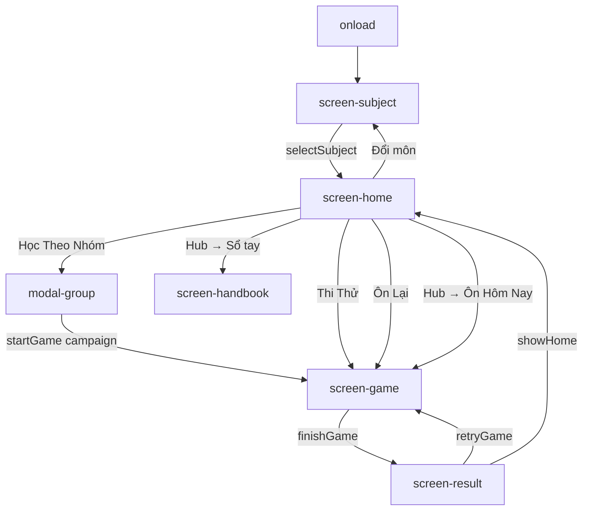

# Quiz — Frontend Architecture

> Ứng dụng ôn tập trắc nghiệm **Đường Lên Đỉnh**  
> Stack: Vanilla JS · Single HTML · Tailwind CDN · Font Awesome 6.7 · Firebase (optional)

---

## 1. Tech Stack

| Vai trò       | Công nghệ                                              |
| ------------- | ------------------------------------------------------ |
| UI            | HTML5 + Tailwind CSS (CDN)                             |
| Logic         | Vanilla JavaScript (một file `index.html`)             |
| Font          | Google Fonts — Nunito                                  |
| Icons         | Font Awesome 6.7.2 (CDN)                               |
| State local   | `localStorage` (per subject)                           |
| Cloud sync    | Firebase Auth (Anonymous) + Firestore (tùy cấu hình)   |
| Deploy        | Vercel / static hosting                                |
| Build         | Không có — zero build step                             |

---

## 2. Cấu trúc dự án

```
Quiz/
├── index.html          # Toàn bộ app: HTML + CSS + JS + QUESTION_BANKS
├── README.md
├── ARCHITECTURE.md
└── PhanTichNghiepVu.md
```

> Toàn bộ logic nằm trong `index.html` (~10.000+ dòng). Không có `src/`, bundler hay framework.

### Cấu trúc logic bên trong `index.html`

```
index.html
├── <head>
│   ├── Tailwind CDN
│   ├── Font Awesome CDN
│   └── <style>           # Custom CSS, responsive, game/home screens
│
├── <body> #app
│   ├── screen-subject    # Chọn môn học
│   ├── screen-home       # Trang chủ (3 nút chính + hub)
│   ├── modal-group       # Chọn chặng (campaign)
│   ├── modal-review-hub  # Dashboard SR + shortcuts
│   ├── screen-game       # Màn chơi (dùng chung mọi mode)
│   ├── screen-result     # Kết quả + Làm lại
│   └── screen-handbook   # Sổ tay tra cứu
│
└── <script>
    ├── SUBJECTS              # Metadata từng môn (theme, icon, title)
    ├── QUESTION_BANKS        # Ngân hàng câu hỏi embedded
    ├── subjectManager        # Chọn môn, load/save localStorage, cloud payload
    ├── reviewDateUtils       # Helper ngày tháng
    ├── reviewStorage         # reviewData + reviewMeta local/Firestore
    ├── reviewEngine          # SR scheduling (Anki-lite)
    ├── reviewUI              # Dashboard hub, spaced grade bar
    ├── Game core             # startGame, selectAnswer, finishGame, timer, helps
    ├── Handbook              # renderHandbook, filterHandbook
    └── Firebase integration  # Anonymous auth, sync users + reviewData
```

---

## 3. Mô hình dữ liệu câu hỏi

```js
{
  id: number,
  text: string,
  options: string[4],
  answer: 0 | 1 | 2 | 3,   // index đáp án đúng
  explanation: string,     // nguồn gốc / fallback
  keywords: string,        // mẹo nhớ, phân biệt distractor (hiển thị trên UI)
}
```

### Ngân hàng theo môn (`QUESTION_BANKS`)

| Key       | Môn                     | Số câu |
| --------- | ----------------------- | ------ |
| `tthcm`   | Tư tưởng Hồ Chí Minh    | 300    |
| `thml`    | Triết học Mác - Lênin   | 361    |
| `swt_pt1` | Software Testing PT1    | 166    |

Thêm môn mới: khai báo trong `SUBJECTS` + thêm array tương ứng trong `QUESTION_BANKS`.

---

## 4. Luồng dữ liệu (Data Flow)

### 4.1 State trong memory (global)

```js
currentSubjectId      // môn đang chọn
questionBank          // ref → QUESTION_BANKS[subjectId]
markedQuestions       // id[] bookmark
reviewedQuestions     // id[] đã ôn (mode review)
groupLastResult       // { "0": { correct, total, percent } }
campaignRun           // { groupIndex, correctIds: Set } — phiên campaign
currentMode           // "campaign" | "exam" | "review" | "spaced"
currentQuestions      // subset câu đang chơi
reviewData            // { [questionId]: ReviewEntry }
reviewMeta            // { streak, lastReviewDay }
```

### 4.2 Persist local

```
User action (bookmark, finish chặng, SR grade, …)
  → saveMarked() / saveReviewed() / saveGroupLastResult() / reviewStorage.saveLocal()
    → localStorage.setItem(`quiz_${subjectId}_${suffix}`, JSON)
      → (optional) window.saveUserData(getAppDataForCloud())
        → Firestore users/{uid}
```

### 4.3 Khởi động app

```
window.onload
  → subjectManager.migrateLegacyData()
  → showSubjectSelection()
```

Chọn môn → `selectSubject(id)` → load state → `screen-home`.

---

## 5. Màn hình & Navigation

Không dùng router — điều hướng bằng `hideAllScreens()` + toggle class `hidden` trên từng `#screen-*`.

| Screen / Modal       | ID                  | Mở từ                          |
| -------------------- | ------------------- | ------------------------------ |
| Chọn môn             | `screen-subject`    | `onload`, nút Đổi môn          |
| Trang chủ            | `screen-home`       | Sau chọn môn, sau result/home  |
| Chơi game            | `screen-game`       | `startGame(mode)`              |
| Kết quả              | `screen-result`     | `finishGame()`                 |
| Sổ tay               | `screen-handbook`   | Hub, openHandbook              |
| Chọn chặng           | `modal-group`       | Học Theo Nhóm                  |
| Hub tiến độ          | `modal-review-hub`  | Nút chart góc phải Home        |

### Body class flags

| Class            | Ý nghĩa                          |
| ---------------- | -------------------------------- |
| `subject-active` | Màn chọn môn                     |
| `home-active`    | Màn home                         |
| `game-active`    | Đang chơi                        |

---

## 6. Chế độ chơi (Game Modes)

```js
startGame(mode, groupIndex = 0)
```

| mode       | UI title        | Câu hỏi                          | Timer              | Đặc biệt                    |
| ---------- | --------------- | -------------------------------- | ------------------ | --------------------------- |
| `campaign` | Chặng N         | slice 20 câu theo `groupIndex`   | n × 45s            | `campaignRun.correctIds`    |
| `exam`     | Thi Thử         | 50 random                        | 1800s              | Score /10                   |
| `review`   | Ôn Lại          | filter `markedQuestions`         | n × 45s            | Đúng → Đã Ôn                |
| `spaced`   | 🔥 Ôn Hôm Nay   | filter `getDueQuestions()`       | ❌                 | Grade bar Again/Hard/Good/Easy |

### Vòng đời một câu (game)

```
loadQuestion()
  → user selectAnswer(index)
    → disable buttons, highlight correct/wrong
    → (campaign) update campaignRun Set
    → (exam) update score
    → showAnswerPanel (trừ exam đúng)
  → nextQuestion() / finishGame()
```

Phím tắt: `handleGameKeydown` — `1-4` chọn đáp án; `Space`/`-` tiếp/hoàn thành.

---

## 7. Module chi tiết

### 7.1 `subjectManager`

| Method                    | Vai trò                                      |
| ------------------------- | -------------------------------------------- |
| `storageKey(sid, suffix)` | `quiz_{sid}_{suffix}`                        |
| `selectSubject(id)`       | Switch môn, load state, render UI            |
| `loadSubjectState`        | Parse localStorage → globals                 |
| `persistCurrentSubjectState` | Ghi marked/reviewed/group/…             |
| `getSubjectPayload`       | Snapshot cho Firebase                        |
| `applySubjectPayload`     | Merge từ cloud                               |
| `renderSubjectCards`      | UI chọn môn                                  |
| `migrateLegacyData`       | Key localStorage cũ → format mới             |

### 7.2 `reviewStorage` + `reviewEngine`

**ReviewEntry:**

```js
{
  questionId, repetition, interval, easeFactor,
  dueDate,      // "YYYY-MM-DD"
  lastReview,   // ISO datetime
  totalReview, correctCount
}
```

**Grades:**

| Grade  | interval | repetition |
| ------ | -------- | ---------- |
| again  | 1 ngày   | reset 0    |
| hard   | 3 ngày   | +1         |
| good   | 7 ngày   | +1         |
| easy   | 14 ngày  | +1         |

`getDueQuestions()` → ids có `dueDate <= today`.

### 7.3 Tiến độ chặng (Campaign %)

```js
getGroupCompletionPercent(i) → groupLastResult[i]?.percent ?? 0
```

Lưu khi `finishGame()` + `currentMode === "campaign"`:

```js
groupLastResult[groupIndex] = { correct, total, percent }
```

---

## 8. Firebase Integration

Chỉ khởi tạo khi `firebaseConfig.apiKey !== "YOUR_API_KEY"`.

```
firebase.initializeApp(config)
  → signInAnonymously()
    → load users/{uid} + reviewData subcollection
      → applyCloudData / applyCloudReviewData
```

### API surface (window)

| Function                 | Mô tả                           |
| ------------------------ | ------------------------------- |
| `getAppDataForCloud()`   | Export toàn bộ subjects state   |
| `applyCloudData(data)`   | Import user doc                 |
| `applyCloudReviewData`   | Merge SR entries                |
| `saveUserData(data)`     | Ghi `users/{uid}`               |
| `saveReviewDataDoc`      | Ghi 1 entry SR                  |
| `saveReviewDataBatch`    | Ghi batch SR                    |
| `loadReviewDataCollection` | Đọc subcollection             |

---

## 9. CSS Convention

- **Tailwind utility classes** trên HTML cho layout nhanh
- **Custom `<style>` block** cho:
  - Game screen (fixed answer panel height, mobile typography)
  - Home responsive (vertical mobile / horizontal desktop)
  - Modal, result, handbook breakpoints
- **Không CSS Modules** — class Tailwind + vài id selector (`#screen-game`, …)
- Font: `Nunito` — title dùng `bg-clip-text` gradient; cần `line-height: 1.4` + padding cho dấu tiếng Việt

---

## 10. Icon Convention (Font Awesome 6)

CDN: `cdnjs.cloudflare.com/ajax/libs/font-awesome/6.7.2/css/all.min.css`

```html
<i class="fa-solid fa-graduation-cap text-2xl"></i>
```

Icon môn khai báo trong `SUBJECTS[].icon` (vd: `fa-vial-circle-check` — cần FA ≥ 6.1).

---

## 11. localStorage Key Reference

| Key                         | Scope   | Type        |
| --------------------------- | ------- | ----------- |
| `quiz_current_subject`      | Global  | string      |
| `quiz_{sid}_marked`         | Subject | `number[]`  |
| `quiz_{sid}_reviewed`       | Subject | `number[]`  |
| `quiz_{sid}_group_mastery`  | Subject | `object`    |
| `quiz_{sid}_group_last_result` | Subject | `object` |
| `quiz_{sid}_review_data`    | Subject | `object`    |
| `quiz_{sid}_review_meta`    | Subject | `{streak,lastReviewDay}` |

---

## 12. Sơ đồ luồng tổng quan



---

## 13. Hạn chế kiến trúc & hướng mở rộng

| Hiện trạng              | Hướng cải thiện                          |
| ----------------------- | ---------------------------------------- |
| Monolith 1 file         | Tách `banks/*.json`, `js/modules/*.js`   |
| Không type check        | TypeScript + Vite nếu team lớn           |
| Bank embed trong HTML   | Build script merge JSON → bundle         |
| Firebase optional       | Env vars trên Vercel cho config          |
| Không test tự động      | Unit test cho reviewEngine, parse bank   |

---

## 14. Scope hiện tại

- ✅ Đa môn, chọn môn, tiến độ tách biệt
- ✅ Campaign / Exam / Review / Spaced
- ✅ Bookmark, Sổ tay, export/import
- ✅ SR dashboard + streak
- ✅ Firebase sync (khi config)
- ✅ Responsive mobile + keyboard shortcuts
- ⏸ Tài khoản user thật
- ⏸ Backend API / admin quản lý câu hỏi
- ⏸ PWA offline
